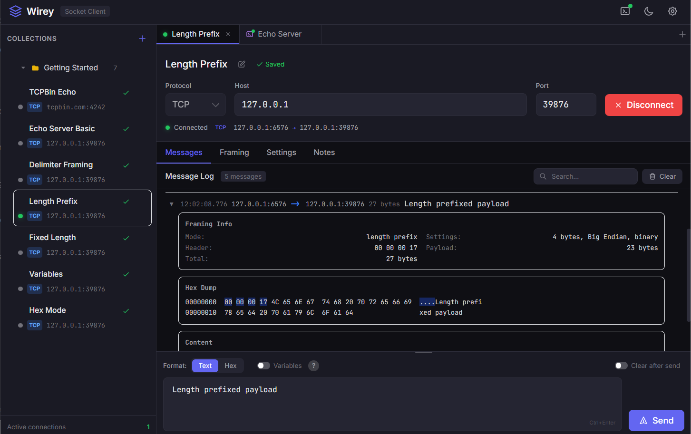
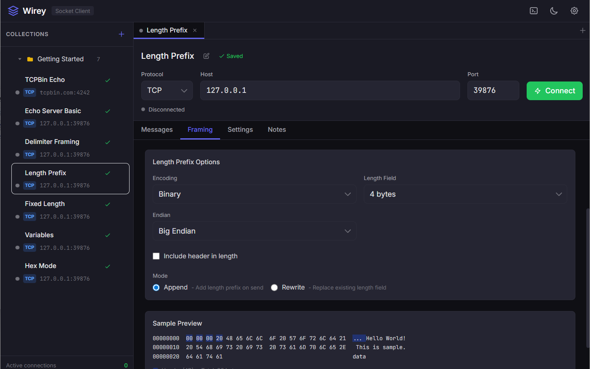
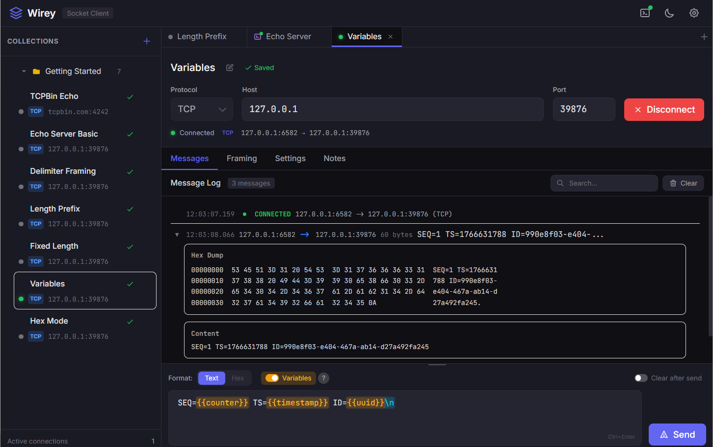
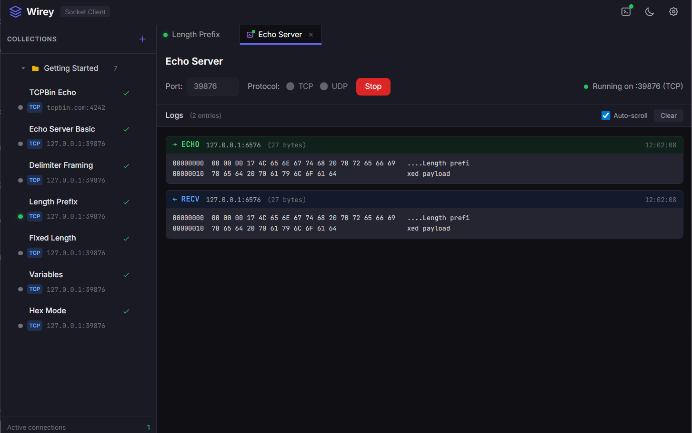

# Wirey

**A Modern Socket Testing Client for Developers**

  

  
  
  

---

## What is Wirey?

**Wirey** is a desktop socket testing client designed for developers and QA engineers. Test TCP/UDP connections with an intuitive GUI instead of struggling with command-line tools like netcat or telnet.

## Download

| Platform | Download                                                                                                         |
| -------- | ---------------------------------------------------------------------------------------------------------------- |
| Windows  | [wirey-x64.zip](https://github.com/yunjywork/wirey/releases/latest/download/wirey-x64.zip)                       |
| macOS    | [wirey-arm64.dmg](https://github.com/yunjywork/wirey/releases/latest/download/wirey-arm64.dmg)                   |
| Linux    | [wirey-linux-amd64.tar.gz](https://github.com/yunjywork/wirey/releases/latest/download/wirey-linux-amd64.tar.gz) |

> See [Releases](https://github.com/yunjywork/wirey/releases) for all versions

---

## Features

### 🔌 Multi-Protocol Support

- **TCP** and **UDP** connections
- Multiple simultaneous connections
- Real-time connection status tracking

### 📦 Flexible Message Framing

Configure various framing modes to match your protocol:

  

| Mode          | Description                                              |
| ------------- | -------------------------------------------------------- |
| None          | Raw transmission without framing                         |
| Delimiter     | Split messages by delimiter (`\n`, `\r\n`, `\0`, custom) |
| Length-Prefix | Length header + payload (binary/ascii/hex/bcd encoding)  |
| Fixed-Length  | Fixed size messages with padding                         |

### 🔤 Dynamic Variables

Use built-in variables in your messages for dynamic content:

  

- `{{timestamp}}` - Unix timestamp
- `{{uuid}}` - UUID v4
- `{{counter}}` - Auto-incrementing counter
- And more...

### 📜 Scripts

Transform and automate your messages with JavaScript:

  

| Script Type | Description |
| ----------- | ----------- |
| Setup | Initialize variables before sending |
| Pre-send | Transform message before transmission |
| Post-recv | Extract values from received messages |

- **Dry Run** mode to test scripts without sending
- Built-in API for variable manipulation and HTTP requests

### 🌍 30+ Character Encodings

- **Unicode**: UTF-8, UTF-16, UTF-16LE, UTF-16BE
- **Asian**: EUC-KR, Shift-JIS, EUC-JP, GB2312, GBK, Big5
- **European**: ISO-8859-1~15, Windows-1252
- **Others**: ASCII, KOI8-R

### 🧪 Built-in Echo Server

Test your messages locally with the integrated echo server:

  

### 🛠 Developer-Friendly

- **Text ↔ Hex** real-time conversion
- **Wireshark-style** hex dump view
- **Hex Dump Parser** - Paste hex dump to create messages
- **Notes Editor** - Markdown notes with edit/preview mode
- Message search and filtering
- Dark/Light theme support
- Organized test cases with Collections

---

## Quick Start

1. **Create a Collection** - Click `+ New` in the sidebar
2. **Add a Test Case** - Right-click collection → Add Case
3. **Configure Connection** - Set protocol, host, and port
4. **Connect & Send** - Click Connect, type message, hit Send

---

## Roadmap

- [ ] Load Testing - Concurrent connection stress testing

---

## Support

If you find Wirey useful, consider supporting the project!

---

## License

Free to use for personal and commercial purposes.
All rights reserved.

Made with ❤️ for developers who test sockets

